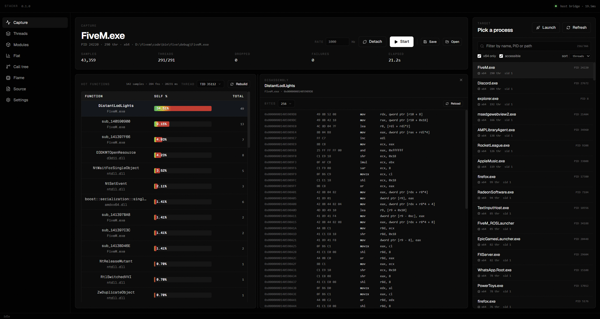
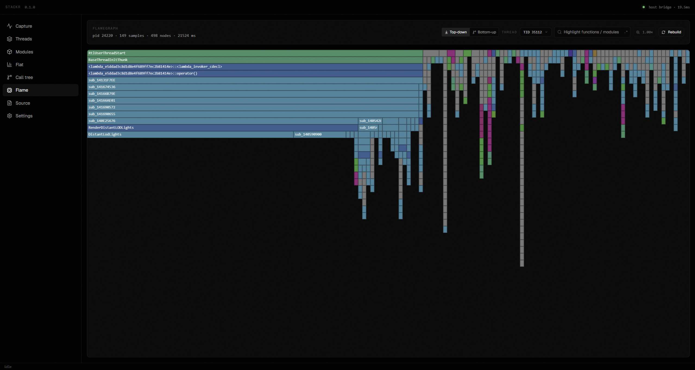
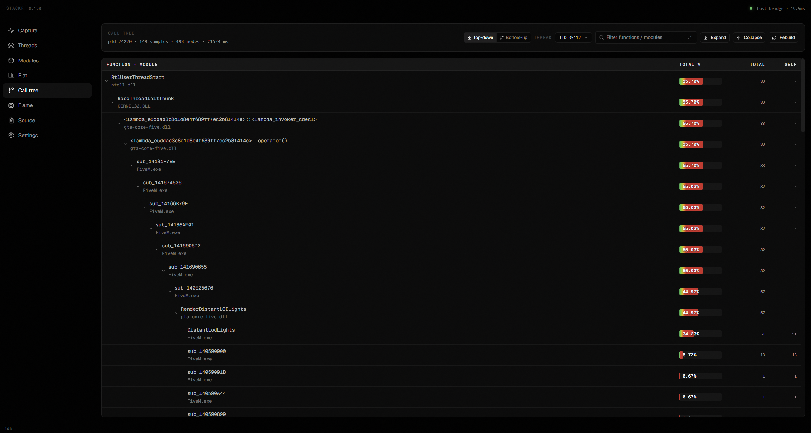
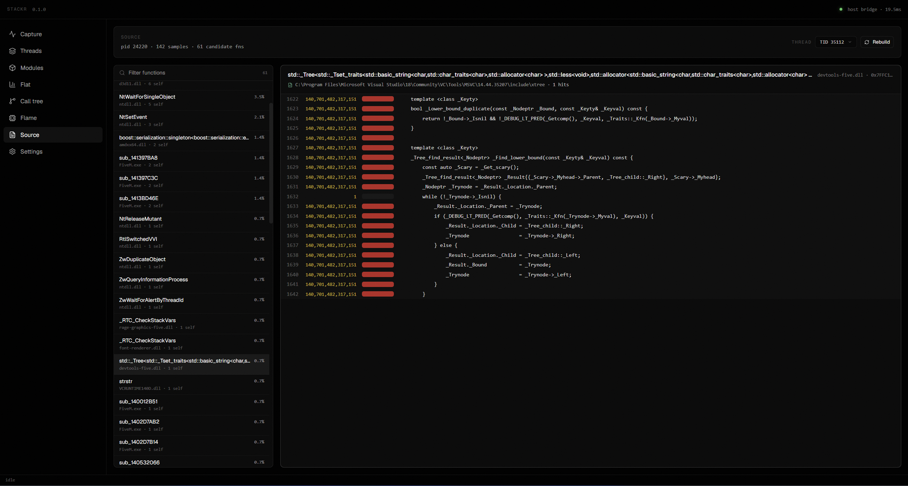

# Stackr

A CPU sampling profiler for Windows. Attach to any running process, sample its call stacks at whatever rate you like, and explore the results across several analysis views: flat profile, call tree, flame graph, source-level attribution, and more.

---

## Screenshots

<table>
  <tr>
    <td></td>
    <td></td>
  </tr>
  <tr>
    <td><em>Live hot functions with inline disassembly</em></td>
    <td><em>Zoomable flame graph</em></td>
  </tr>
  <tr>
    <td></td>
    <td></td>
  </tr>
  <tr>
    <td><em>Call tree (top-down / bottom-up)</em></td>
    <td><em>Source view with per-line sample counts</em></td>
  </tr>
</table>

---

## What it does

Stackr suspends each thread of the target process briefly, captures the call stack via `StackWalk64`, then resumes. Do that a few hundred times per second and you get a representative picture of where the process is actually spending time, no instrumentation, no recompilation, no code changes.

The results are navigable across multiple views:

- **Capture:** Live hot-functions table that updates while sampling. Click any row to disassemble the function inline.
- **Flat Profile:** Full aggregated list, sortable, filterable by thread. Self time and total time columns.
- **Call Tree:** Tree of callers and callees, switchable between top-down and bottom-up. Rename any node for readability.
- **Flame Graph:** Zoomable flame chart. Right-click any frame to navigate to its source or flat profile entry.
- **Modules:** Grouped by DLL/EXE so you can immediately see which library is hot.
- **Threads:** Per-thread breakdown with CPU time (actual OS-measured kernel+user) and sample counts.
- **Source View:** Sample counts pinned to individual lines of source code, when PDB line info is available.
- **Disassembly:** x86 listing with Capstone, shown inline next to the flat profile.

Captures can be saved to `.stackr` files, binary format that stores the raw samples, resolved symbol names, source paths, and per-thread CPU times. Load them later on the same or a different machine without needing the target process to be running.

---

## Requirements

**To run:**
- Windows 10 or 11, x64
- WebView2 Runtime (comes preinstalled on Windows 11; on Windows 10 the installer is a few MB from Microsoft)
- Administrator rights or `SeDebugPrivilege` to attach to processes you don't own

**To build:**
- Visual Studio 2022 (MSVC v143) with the C++ workload
- CMake 3.25 or later
- Node.js 20+ and [pnpm](https://pnpm.io/)

CMake downloads WebView2 and Capstone automatically on first configure; no manual dependency setup needed.

---

## Building

```powershell
# Build the frontend first, CMake embeds the output into the exe
cd web
pnpm install
pnpm build

# Configure (x64 only, Stackr doesn't support 32-bit)
cd ..
cmake -A x64 -B build

# Compile
cmake --build build --config Release

# The binary ends up here
./build/bin/Stackr.exe
```

### Development mode

If you're working on the frontend, rebuilding the static export on every change is tedious. Instead you can point the host at the Next.js dev server:

```powershell
# Terminal 1 start the dev server
cd web
pnpm dev

# Terminal 2 build the host with dev mode on
cmake -A x64 -B build -DSTACKR_DEV_SERVER=ON
cmake --build build --config Debug
./build/bin/Stackr.exe
```

The host will load `http://localhost:3000` instead of the embedded assets. Hot reload works normally. Changes to C++ code still require a rebuild.

---

## Project layout

```
host/       C++ backend
  src/
    analysis/   Flat profile, call tree, source view engines
    disasm/     Capstone wrapper + RPC methods
    ipc/        JSON-RPC router (postMessage transport)
    process/    Process enumeration, attach, launch
    sampler/    Sampling loop, stack walker, save/load
    symbols/    DbgHelp session, resolver, symbol search path
    webview/    WebView2 lifetime + virtual resource host
    util/       Logging, JSON writer

web/        Next.js frontend (TypeScript + React + Tailwind)
  src/
    app/        Root layout and page
    components/ One file per view
    lib/        RPC bridge, settings store, navigation

cmake/      CMake helpers (WebView2, Capstone, asset embedding)
```

---

## Contributing

Pull requests are welcome. A few things worth knowing before you start:

**The RPC interface is the boundary.** The C++ side registers methods via `r.on("method.name", handler)` in each module's `register_methods()`. The TypeScript side calls them through `rpc.call()` in `lib/bridge.ts`. Adding a new feature typically means: one new handler in C++, one new function in the bridge, one new component or extension to an existing one. Try to keep that boundary clean.

**No instrumentation, no kernel drivers.** Everything Stackr does goes through documented Win32 APIs. The goal is a tool that works on any Windows machine without special setup, so keep it that way.

**Symbol resolution is per-session.** `process.attach` creates a DbgHelp session for the target PID. Analysis methods borrow from that session. Loaded captures use an offline resolver backed by the symbols stored in the `.stackr` file, the live DbgHelp path is not involved.

---

## File format

Captures are stored as `.stackr` files (binary, version 1):

| Section | Contents |
|---|---|
| Header (32 bytes) | Magic `STACKR\0\0`, version, PID, elapsed ms, sample count |
| Samples | Per sample: timestamp (ns), TID, stack depth, frames (up to 64 `uint64` addresses) |
| Symbol table | Per unique address: function name, module name, source path, module base, displacement, source line |
| CPU times | Per thread: TID + accumulated kernel+user time in 100ns units |